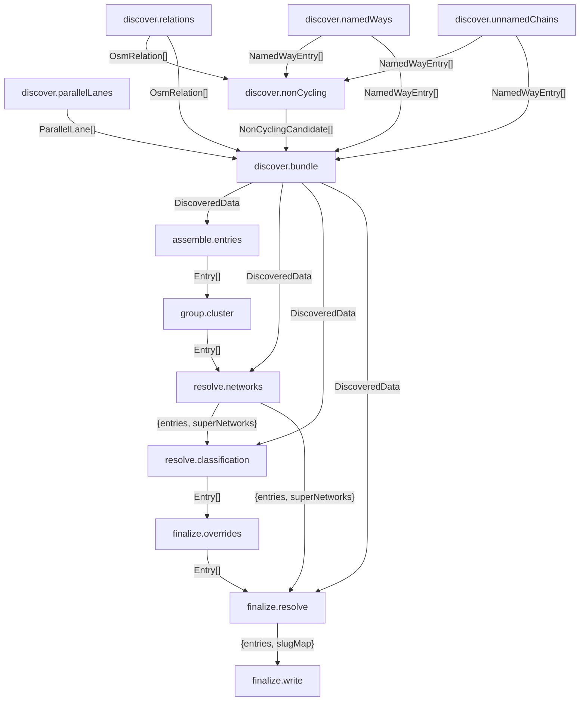

# Pipeline graph (auto-generated)

> **Generated by `make bikepaths` from the live TaskGraph in `scripts/pipeline/build-bikepaths.ts`. Do not edit by hand.**
>
> See `_ctx/pipeline-overview.md` for architecture and trace workflow.

## Phases

| Phase | Depends on | Produces |
|---|---|---|
| discover.relations | — | OsmRelation[] |
| discover.namedWays | — | NamedWayEntry[] |
| discover.parallelLanes | — | ParallelLane[] |
| discover.unnamedChains | — | NamedWayEntry[] |
| discover.nonCycling | discover.relations, discover.namedWays, discover.unnamedChains | NonCyclingCandidate[] |
| discover.bundle | discover.relations, discover.namedWays, discover.parallelLanes, discover.unnamedChains, discover.nonCycling | DiscoveredData |
| assemble.entries | discover.bundle | Entry[] |
| group.cluster | assemble.entries | Entry[] |
| resolve.networks | group.cluster, discover.bundle | {entries, superNetworks} |
| resolve.classification | resolve.networks, discover.bundle | Entry[] |
| finalize.overrides | resolve.classification | Entry[] |
| finalize.resolve | finalize.overrides, resolve.networks, discover.bundle | {entries, slugMap} |
| finalize.write | finalize.resolve | {entries, slugMap} |

## Graph

