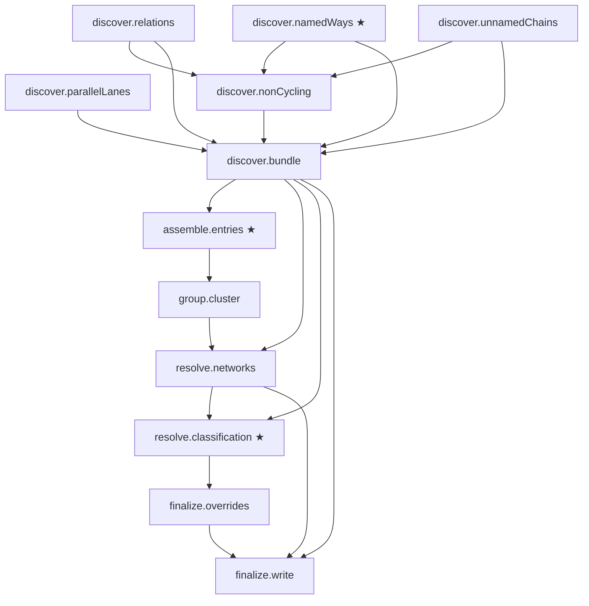

# Pipeline graph (auto-generated)

> **Generated by `make bikepaths` from the live TaskGraph in `scripts/pipeline/build-bikepaths.ts`. Do not edit by hand.**
>
> See `docs/plans/2026-04-09-pipeline-tracing-refactor-design.md` for design.

## Phases

| Phase | Depends on |
|---|---|
| discover.relations  | — |
| discover.namedWays ★ | — |
| discover.parallelLanes  | — |
| discover.unnamedChains  | — |
| discover.nonCycling  | discover.relations, discover.namedWays, discover.unnamedChains |
| discover.bundle  | discover.relations, discover.namedWays, discover.parallelLanes, discover.unnamedChains, discover.nonCycling |
| assemble.entries ★ | discover.bundle |
| group.cluster  | assemble.entries |
| resolve.networks  | group.cluster, discover.bundle |
| resolve.classification ★ | resolve.networks, discover.bundle |
| finalize.overrides  | resolve.classification |
| finalize.write  | finalize.overrides, resolve.networks, discover.bundle |

★ = star bug-cluster boundary (gets aggressive trace coverage)

## Graph

