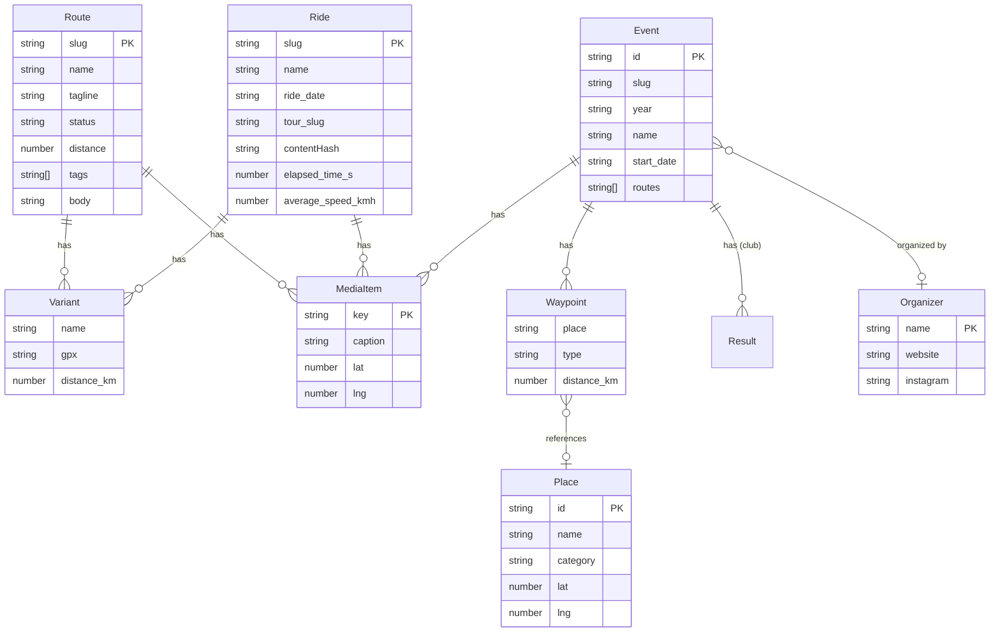
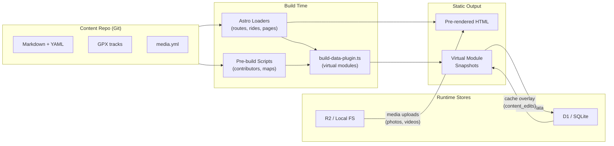
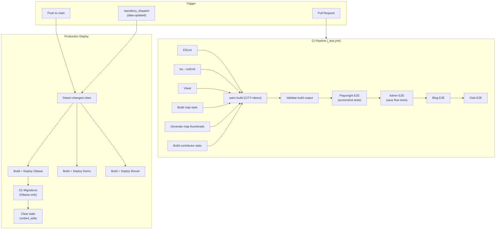
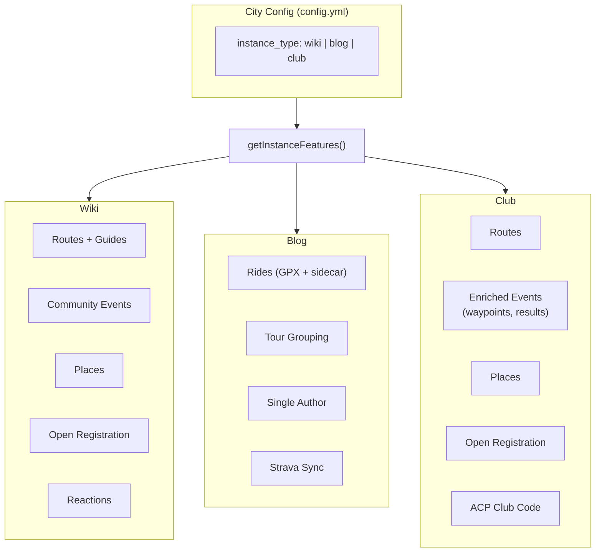
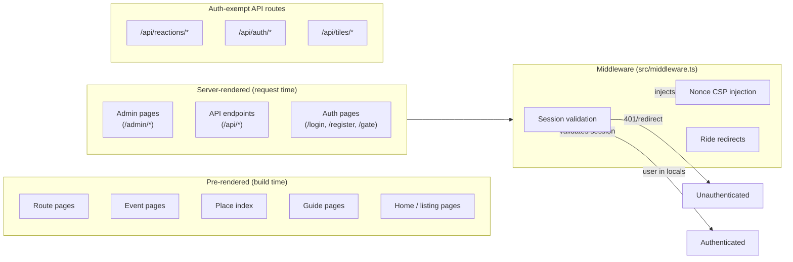

# Architecture

Visual overview of whereto.bike's architecture. For implementation details, conventions, and gotchas, see `AGENTS.md`.

---

## 1. Data Models

Content types share a base contract (`GitFileSnapshot`, `GitFiles`, `computeHashFromParts`) defined in `src/lib/models/content-model.ts`. Each type extends this with its own schema, hash function, and git/cache serialization.

Key files:

- `src/lib/models/content-model.ts` -- shared base (`GitFileSnapshot`, `GitFiles`, `baseMediaItemSchema`)
- `src/lib/models/route-model.ts` -- `RouteDetail`, variants, media with upload tracking
- `src/lib/models/ride-model.ts` -- `RideDetail`, GPX-derived metrics, tour grouping
- `src/lib/models/event-model.ts` -- `EventDetail`, waypoints, results, registration
- `src/lib/models/place-model.ts` -- `PlaceDetail`, geo-located points of interest
- `src/schemas/index.ts` -- Zod schemas for content collections (public-facing)

---

## 2. Data Stores

Four data stores, each serving a distinct role. Content flows from the Git repo through build-time processing into virtual modules, with D1 and R2 handling runtime state.

**Content repo** (`CONTENT_DIR`): Git repository with Markdown, YAML, and GPX files. The source of truth for all content. Structure: `{city}/routes/`, `{city}/events/`, `{city}/places/`, `{city}/rides/`.

**D1 / SQLite** (`src/db/schema.ts`): Runtime database with tables for `content_edits` (post-deploy cache overlay), `users`, `credentials`, `sessions`, `reactions`, `video_jobs`, `upload_attempts`, `email_tokens`, `user_settings`, and `strava_tokens`. Admin pages merge D1 cache entries over virtual module snapshots via `src/lib/content/load-admin-content.ts`.

**R2 / Local FS** (`src/lib/storage/storage-local.ts`): Blob storage for uploaded media. Photos served via `cdn-cgi/image/` transform URLs. Videos served directly.

**Virtual modules** (`src/build-data-plugin.ts`): 13+ modules compiled at build time. Admin content modules (`admin-routes`, `admin-route-detail`, etc.) provide the baseline data that D1 cache entries overlay. Photo index modules aggregate geolocated media across content types.

---

## 3. CI Pipelines

**Build order**: `build-map-style` + `generate-maps` + `build-contributors` must run before `astro build` because they generate files consumed by virtual modules and static assets.

**Test matrix**: lint, typecheck, and unit tests run in parallel before the build. E2E suites (screenshot, admin, blog, club) run sequentially after the build, all against `CITY=demo`.

**Production deploy** (`production.yml`): Triggered by push to main or `data-updated` webhook from the content repo. Uses a matrix strategy to build/deploy Ottawa, demo, and brevet in parallel. D1 migrations run only in the Ottawa job (all cities share one database). After deploy, stale `content_edits` rows (older than `BUILD_START`) are purged.

**Staging** (`staging.yml`): Triggered by `staging-data-updated` webhook or manual dispatch. Deploys Ottawa only, using `data-ref: staging`.

Key files: `.github/workflows/ci.yml`, `_test.yml`, `_build-city.yml`, `production.yml`, `staging.yml`.

---

## 4. Instance Types

One codebase serves three instance types, selected via `instance_type` in `{city}/config.yml`. Feature flags drive capability checks -- use `getInstanceFeatures()` for UI/content decisions, `isBlogInstance()`/`isClubInstance()` only for structural choices (loaders, virtual modules).

| Capability | Wiki | Blog | Club |
|---|---|---|---|
| Routes | yes | -- | yes |
| Rides (GPX journal) | -- | yes | -- |
| Events | yes | -- | yes |
| Enriched events (results, waypoints) | -- | -- | yes |
| Places | yes | -- | yes |
| Guides | yes | -- | -- |
| Community registration | yes | -- | yes |
| Reactions | yes | -- | yes |
| License notice | yes | -- | yes |

Content loading adapts per instance: blog instances use `rideLoader()` for the `routes` collection instead of `routeLoader()` (`src/content.config.ts`). Active content types are enumerated by `getContentTypes()` in `src/lib/content/content-types.ts`, which filters the registry against instance features.

Key files: `src/lib/config/instance-features.ts`, `src/lib/config/city-config.ts`, `src/lib/content/content-types.ts`.

---

## 5. Static vs Server-Rendered

Public pages are pre-rendered at build time (`prerender = true`). Admin pages and API endpoints are server-rendered (`prerender = false`). Every page and endpoint must explicitly export a `prerender` flag.

**Middleware** (`src/middleware.ts`) runs only on server-rendered routes:

- **Auth check**: Admin pages and API endpoints (except `/api/auth/*`, `/api/reactions/*`, `/api/tiles/*`) require a valid session. Missing/expired sessions get 401 (API) or redirect to `/gate` (pages).
- **CSP nonce**: Admin pages and auth pages (`/login`, `/register`, `/setup`, `/gate`, `/auth/verify`) receive a per-request nonce injected into all `<script>` tags.
- **Ride redirects**: Old ride slugs are matched against a virtual module and 301-redirected.

**Data flow difference**: Static pages read from Astro content collections (populated by loaders at build time). Server-rendered admin pages read from virtual module snapshots overlaid with D1 `content_edits` cache. API save endpoints write to both Git (via GitHub API or local git) and D1 cache simultaneously.

Key files: `src/middleware.ts`, `src/lib/content/content-save.ts`, `src/lib/content/load-admin-content.ts`.
